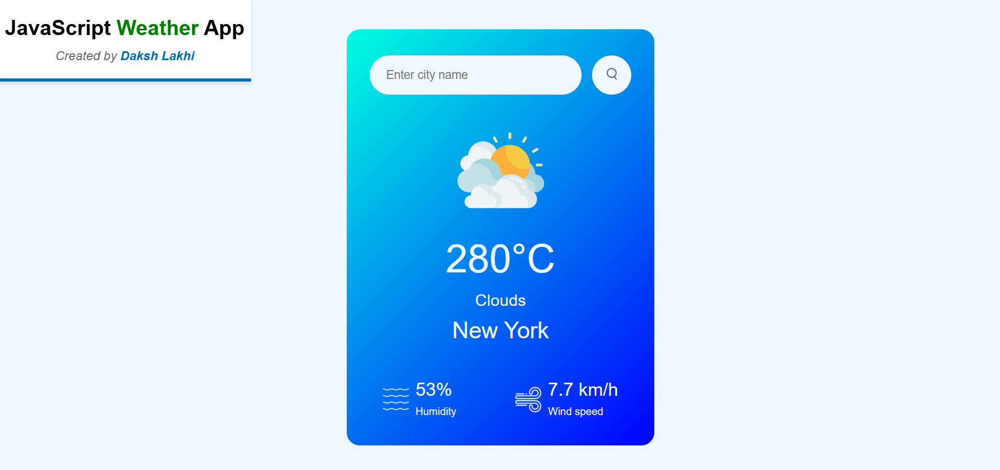

# 🌦️ Weather App

A simple and elegant web application that displays real-time weather information for any city in the world using the OpenWeatherMap API. Built using HTML, CSS, and JavaScript.

### 🔗 Live Demo
Check out the live version here: [Weather App](https://lakhidaksh-01.github.io/Weather-App/)

---

## 📸 Preview

---

## 🚀 Features

- 🔍 Search weather by city name
- 🌡️ Displays temperature, humidity, and wind speed
- 🌤️ Shows current weather conditions with relevant icons
- 💻 Responsive design for all devices
- ⚙️ Real-time data using OpenWeatherMap API

---

## 🛠️ Tech Stack

- **HTML**
- **CSS**
- **JavaScript**
- **OpenWeatherMap API**

---

## Contact

 For any queries or suggestions, feel free to contact me via [dakshlakhi01@gmail.com](mailto:dakshlakhi01@gmail.com).